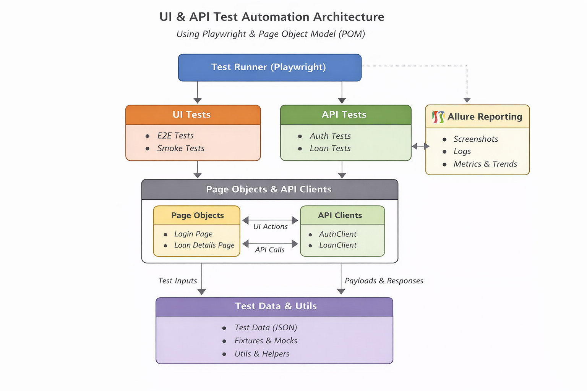

 

  
<h3 align="center">Test Automation Architecture – UI & API (Playwright + POM)</h3>

  

    Architecture design
     
  

  
 

1. Overview

    This document describes the test automation architecture for the First-Time Loan Application using Playwright. The architecture is designed to be scalable, maintainable, reliable, and reusable. I combined UI automation for critical business flows with API automation for fast validation of backend logic.

2. Core Principles
- Separation of Concerns: Page Objects handle UI locators/actions; tests handle flows/assertions
- Reusability: Shared utilities for API calls, data, waits
- API-first testing: Validate business rules at API level before UI tests
- Idempotent tests: Cleanup test data to prevent duplicate application conflicts
- Robustness: Playwright auto-waits, role-based selectors, minimal sleeps

3. Overall Architecture
- Test Runner: Playwright CLI
- Tests: Organized by feature 
  - UI Tests: login.spec.ts, loan_application.spec.ts
  - API Tests: auth.spec.ts, application.spec.ts,application-status.spec.ts
- Page Objects / API Clients:
  - UI Page Objects: loginPage.ts, loan_applicationPage.ts
  - API Clients: AuthClient.ts, LoanClient.ts
- Test Data / Fixtures: customer_data.ts

4. Folder Structure
End-to-end/
  tests/
    api-tests/
      api-client/AuthClient.ts
      login.spec.ts
      application.spec.ts
      application-status.spec.ts
      health-check.spec.ts
    ui-tests/
      utils/payload_builder.ts
      pages/
        LoginPage.ts
        loan_applicationPage.ts
        
  fixtures/auth.fixture.ts
  utils/selectors.ts
  playwright.config.ts
  test_data/test_data.json

5. Page Object Model (POM)
- Concept: Abstract UI elements and actions into reusable classes
- Benefits: Maintainable, readable, reusable

6. Test Data & Fixtures
- Fixtures for default login, phone numbers
- Test data JSON for loan amounts, DOBs, purposes
- Edge cases included (negative amount, invalid date, duplicate ID)

7. Allure reports Integration

- Combined reports provide insights into UI and API test execution
- Add tags/labels for severity, epic, feature
- CI pipeline to generate reports automatically on push/PR
- Attach screenshots, logs, and API responses for full traceability

8. Advantages of This Architecture

- POM: Maintainable, reusable, readable
- API-first: Fast validation, reduces UI dependency
- Explicit waits: Stable tests, less flakiness
- Test data separation: Easy to extend & maintain
- Modular design: Scalable for new flows & pages

9. How to Extend
- Add new pages → create new PageObject class
- Add new API endpoints → create new client
- Add regression tests → reuse existing page objects

