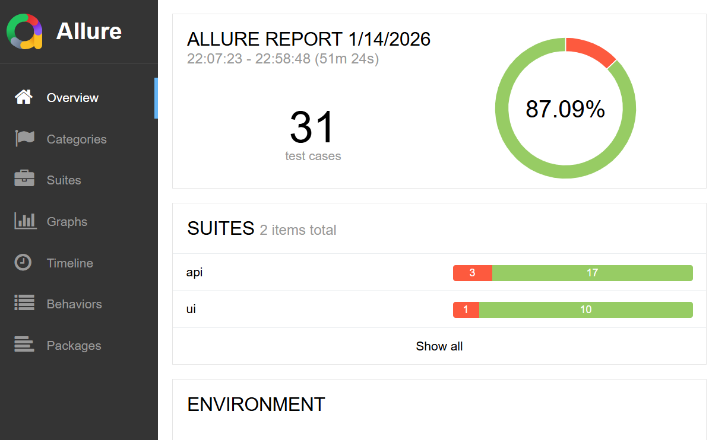

# UI & API Test Automation with Playwright + Allure reports

## 📌 Overview
This repository contains an end-to-end **test automation framework** for the **First-Time Loan Application**. It covers:

- Automated **UI testing** using Playwright
- Automated **API testing** using Playwright API testing capabilities
- **Page Object Model (POM)** design for maintainability
- **Allure Reporting** for rich test reports

The framework is designed to be **scalable, readable, and production-ready**, following industry best practices.

---

## 🧱 Architecture Summary

- **Test Runner**: Playwright Test
- **Design Pattern**: Page Object Model (POM)
- **Test Types**:
  - UI End-to-End Tests
  - API Functional & Validation Tests
- **Reporting**: Allure
- **CI Ready**: GitHub Actions


---

## 📁 Useful documents

- Architecture: Refer to the [architecture](./Automation_architecture.md)  diagram included in the documentation for a visual overview.
- Test Plan :  Refer to the [Test Plan](./Test_plan.md) document to understand the testing approach.
- Bugs : Refer to the [Identified Bugs](./Bugs_and_Gaps.md) document view indetified issues. 


---

## ⚙️ Setup Instructions

### Prerequisites
- Node.js 18+
- npm or yarn
- Java (for Allure CLI)
- Allure CLI installed

### Install Dependencies
```bash
npm install
```

### Install Playwright Browsers
```bash
npx playwright install
```

---

## ▶️ Running Tests

### Run All UI & API Tests
```bash
npx playwright test
```

### Run UI Tests Only
```bash
npm run test:ui
```

### Run API Tests Only
```bash
npm run test:api
```

---

## 📊 Allure Reporting

### Generate Report
```bash
npm run allure:generate
```

### Open Report
```bash
npm run allure:open
```

Allure captures:
- Test steps
- Screenshots on failure
- Logs and attachments
- Trends and execution history

---

## 🧠 Design Decisions & Rationale

- **Playwright**: Unified UI + API testing with auto-waiting and speed
- **POM**: Improves maintainability and reduces duplication
- **API-first strategy**: Faster feedback and stable validation
- **Allure**: Clear visibility for both technical and non-technical stakeholders

---

## 🚀 Future Improvements

- Performance testing (k6)
- Security testing (OWASP ZAP)

---
## Example of how the final report should look like.


## 👤 Author

Lewis Mocha

